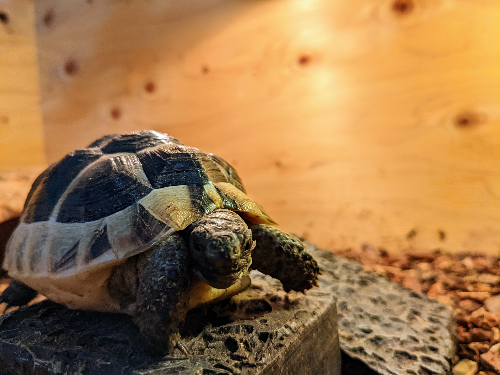

# Tortoise

 

Get cute Tortoises into your Kubernetes garden and say goodbye to the days optimizing your rigid autoscalers. 

## Install

You cannot get it from the breeder, you need to get it from GitHub instead.

```shell
# Install CRDs into the K8s cluster specified in ~/.kube/config.
make install
# Deploy controller to the K8s cluster specified in ~/.kube/config.
make deploy
```

You don't need a rearing cage, but need VPA in your Kubernetes cluster before installing it.

## Motivation

Many developers are working in Mercari, and not all of them are the experts of Kubernetes. 
The platform has many tools and guides to simplify the task of optimizing resource requests,
but the optimization takes engineering cost in every team constantly. 

The optimization should be done every time the situation around the service get changed, which could happen easily and frequently. 
(e.g., the implementation change could change the way of consuming resources, the amount of traffic could be changed, etc)

Also, when it comes to HorizontalPodAutoscaler(HPA), it's nearly impossible for human to optimize.
It’s not a simple problem which we just set the target utilization as high as possible – 
there are many scenarios where the actual resource utilization doesn’t reach the target resource utilization in the first place
(because of multiple containers, minReplicas, unbalanced container’s size etc).

To overcome those challenges,
the platform team start to have Tortoise, which is the automated solution for all optimization needs to be done for Kubernetes resource.

It aims to move the responsibility of optimizing the workloads from the application teams to tortoises (Platform team). 
Application teams just need to set up Tortoise, and the platform team will never bother them again for the resource optimization - 
all actual optimization is done by Tortoise automatically. 

See a detailed motivation in the blog post:
- [Tortoise: Outpacing the Optimization Challenges in Kubernetes at Mercari](https://engineering.mercari.com/en/blog/entry/20240206-3a12bb1288/) 
- [人間によるKubernetesリソース最適化の”諦め”とそこに見るリクガメの可能性](https://engineering.mercari.com/blog/entry/20240206-3a12bb1288/)

## Usage

Tortoise has a very simple interface:

```yaml
apiVersion: autoscaling.mercari.com/v1beta3
kind: Tortoise
metadata:
  name: lovely-tortoise
  namespace: zoo
spec:
  updateMode: Auto 
  targetRefs:
    scaleTargetRef:
      kind: Deployment
      name: sample
```

Then, Tortoise creates fully managed autoscalers (HPA and VPAs). 

Despite its simple appearance, it contains a rich collection of historical data on resource utilization beneath its shell, 
and cleverly utilizes them to manage parameters in autoscalers. 

Please refer to [User guide](./docs/user-guide.md) for other parameters.

## Documentations 

- [User guide](./docs/user-guide.md): describes a minimum knowledge that the end-users have to know, 
and how they can configure Tortoise so that they can let tortoises autoscale their workloads.
- [Admin guide](./docs/admin-guide.md): describes how the cluster admin can configure the global behavior of tortoise. 
- [Emergency mode](./docs/emergency.md): describes the emergency mode.
- [Horizontal scaling](./docs/horizontal.md): describes how the Tortoise does the horizontal autoscaling internally.
- [Vertical scaling](./docs/vertical.md): describes how the Tortoise does the vertical autoscaling internally.
- [Technically details](./docs/internal.md): describes the technically details of Tortoise. (mostly for the contributors)
- [Contributor guide](./docs/contributor-guide.md): describes other stuff for the contributor. (testing etc)

## API definition

- [Tortoise](./api/v1beta3/tortoise_types.go)

## Contribution

Before implementing any feature changes as Pull Requests,
please raise the Issue and discuss what you propose with maintainers.

A major change may have to be proposed via [proposal](./proposals/) process.

Also, please read the CLA carefully before submitting your contribution to Mercari. 
Under any circumstances, by submitting your contribution, 
you are deemed to accept and agree to be bound by the terms and conditions of the CLA.

https://www.mercari.com/cla/

## LICENSE

Copyright 2023 Mercari, Inc.

Licensed under the MIT License.
