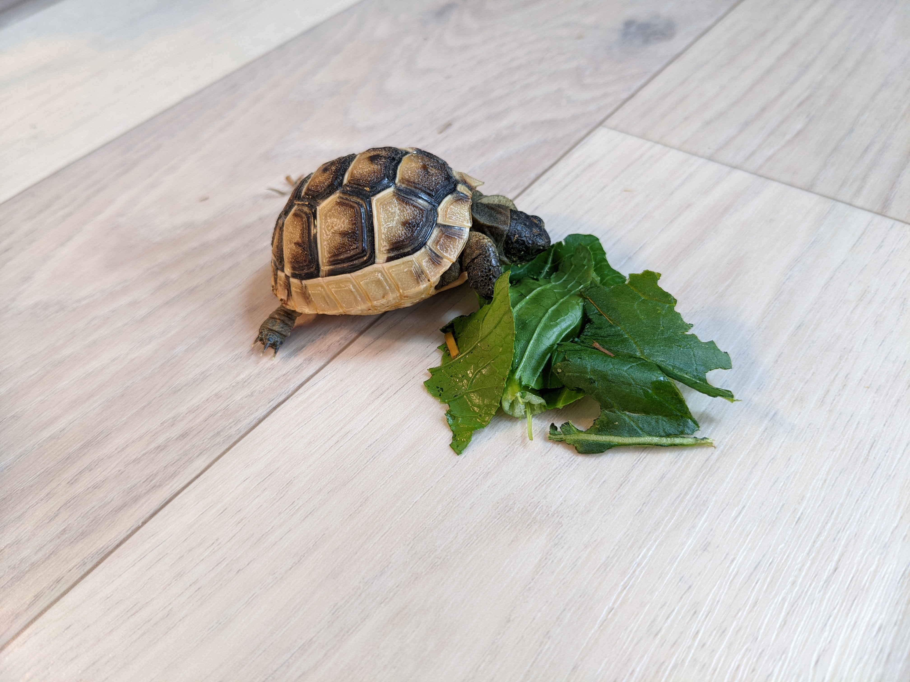

## Admin guide

Tortoise exposes a lot of flags to configure tortoises behavior in the cluster.

The cluster admin can set the global configurations via the configuration file,
and the configuration file is passed via `--config` flag.

See [here](https://pkg.go.dev/github.com/mercari/tortoise/pkg/config#Config) to understand all the parameters the tortoise controller has.
### Argo Rollouts

Tortoise supports [Argo Rollouts](https://argoproj.github.io/rollouts/)' Rollout (`argoproj.io/v1alpha1`) as the scale target, in addition to Deployment.
Tortoise doesn't require Argo Rollouts to be installed; it accesses Rollouts only when a Tortoise targets a Rollout.

To use it, make sure that:
- The tortoise controller can `get`/`update` `rollouts` and `get` `rollouts/scale` in the `argoproj.io` group. The RBAC generated in `config/rbac` has them.
- The VPA recommender can `get` the scale subresource of Rollouts so that the monitor VPA created by Tortoise can target Rollouts.
  The default RBAC of VPA (`system:vpa-target-reader`) grants `get` on `*/scale`.
