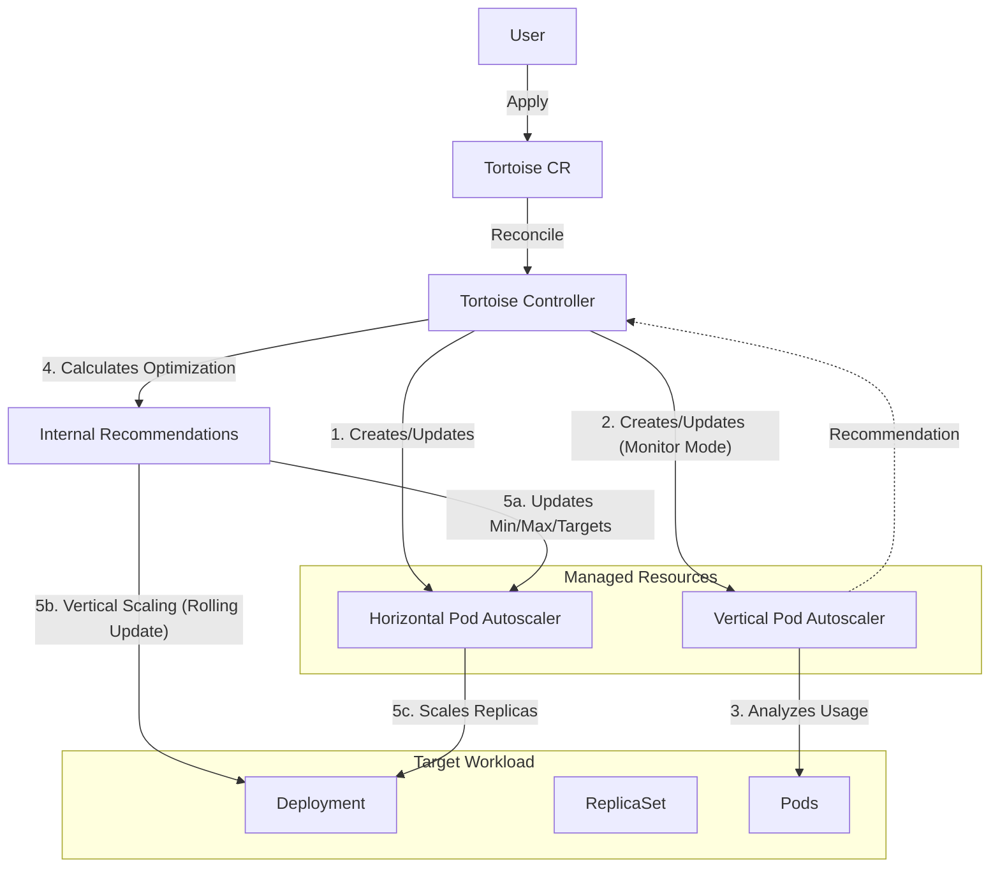

# Architecture

This document provides a deep dive into the internal architecture of Tortoise. It is intended for contributors who want to understand how the controller works under the hood.

## System Overview

Tortoise creates a feedback loop between the user's workload (Deployment), the autoscalers (HPA, VPA), and the Tortoise optimization logic.

## Core Components

### 1. Tortoise Controller
The heart of the system. It runs a reconciliation loop that ensures the actual state matches the desired state defined in the `Tortoise` Custom Resource (CR).

**Key Responsibilities:**
-   **Orchestration**: Manages the lifecycle of associated HPA and VPA resources.
-   **Optimization**: Calculates ideal resource requests and auto-scaling parameters based on historical data (from VPA) and current usage.
-   **Actuation**: Applies changes to HPA (Horizontal scaling) and Deployment (Vertical scaling).
-   **Safety**: Enforces guardrails (e.g., max scaling ratios, cooldown periods) to prevent instability.

### 2. Mutating Webhook
Intercepts `Tortoise` CR creation and updates to:
-   **Validate**: Ensure the configuration is valid (e.g., valid modes, resource policies).
-   **Default**: Apply default values to optional fields (e.g., default `UpdateMode: Off`).

## Internal Services

The `TortoiseReconciler` delegates logic to several specialized services:

-   **`HpaService`**: Wrapper for interacting with HPA resources. Handles creation, updating, and synchronizing specs.
-   **`VpaService`**: Wrapper for interacting with VPA resources. Manages the "Monitor-only" VPA that Tortoise uses to gather data.
-   **`DeploymentService`**: Abstraction for Deployment operations. Handles fetching deployment details, scaling requests, and performing rolling restarts for vertical scaling.
-   **`TortoiseService`**: Contains core domain logic for Tortoise. specific state transitions, finalizer management, and status updates.
-   **`RecommenderService`**: The brain of the operation. It takes VPA recommendations and HPA status to calculate the optimal parameters (Min/Max Replicas, Target Utilization, Container Resource Requests).

## Reconciliation Loop

The `Reconcile` function in [`tortoise_controller.go`](./internal/controller/tortoise_controller.go) follows these steps:

1.  **Fetch & Validation**:
    -   Get the `Tortoise` CR.
    -   Handle deletion (remove HPA/VPA if `DeletionPolicy` allows, remove finalizers).
    
2.  **Resource Discovery**:
    -   Fetch the target Deployment.
    -   Fetch associated HPA and VPA.
    
3.  **Initialization** (Phase: `Initializing`):
    -   If HPA/VPA don't exist, create them.
    -   Set VPA to `Off` (Monitor) mode.
    
4.  **Policy Sync**:
    -   Ensure HPA spec matches the policy defined in Tortoise (e.g., sync metrics).
    
5.  **Data Gathering**:
    -   Check if VPA has produced recommendations.
    -   If not ready, wait (Phase: `GatheringData`).
    
6.  **Recommendation Calculation**:
    -   **Vertical**: detailed analysis of VPA's P90/Max recommendations vs current requests.
    -   **Horizontal**: Calculate optimal `MinReplicas` and `MaxReplicas` based on daily/weekly usage patterns.
    -   **Target Utilization**: specific formula to derive the best HPA target % based on resource headroom.
    
7.  **Actuation (Applying Changes)**:
    -   **HPA**: Update `Spec.MinReplicas`, `Spec.MaxReplicas`, and metrics (target utilization).
    -   **Vertical**: If `UpdateMode` is active and specific conditions are met (e.g., container needs resizing), direct update to Deployment's PodTemplate.
        -   *Note*: This triggers a Rolling Update.
        
8.  **Status Update**:
    -   Record recommendations and the current phase in `Tortoise.Status`.

## State Machine (Tortoise Phases)

Tortoise transitions through several phases during its lifecycle:

| Phase | Description |
| :--- | :--- |
| `Initializing` | Initial state. Creating dependent resources (HPA, VPA). |
| `GatheringData` | Waiting for VPA to provide sufficient historical data. No actions taken yet. |
| `PartlyWorking` | Some recommendations are ready, but others (e.g., for a specific container) are still gathering data. |
| `Working` | Fully operational. Producing and applying recommendations. |
| `Emergency` | Emergency mode triggered (e.g., by user or critical metric failure). High resources/replicas enforced. |
| `BackToNormal` | Recovering from Emergency mode, gradually returning to normal operation. |

## Data Flow Logic

### From VPA to Optimization
Tortoise uses VPA strictly as a data source (Monitor Mode).
1.  VPA calculates `Target` (P90) and `UncappedTarget` recommendations.
2.  Tortoise reads these values.
3.  **For Vertical Scaling**:
    -   Tortoise sets `request` = `VPA Recommendation` (with some smoothing/padding).
4.  **For Horizontal Scaling**:
    -   Tortoise calculates `TargetUtilization` = `100 - (VPA_Max / Current_Request - Current_Target_Util)`.
    -   This complex formula ensures that HPA targets a utilization level that keeps the *actual* usage (P90) safely below 100%.

### Safety Guardrails
To prevent thrashing or outages:
-   **Vertical Scaling Frequency**: Limited to once per hour (by default) to avoid constant pod restarts.
-   **Max Scale Down**: Prevents reducing resources too aggressively in a single step.
