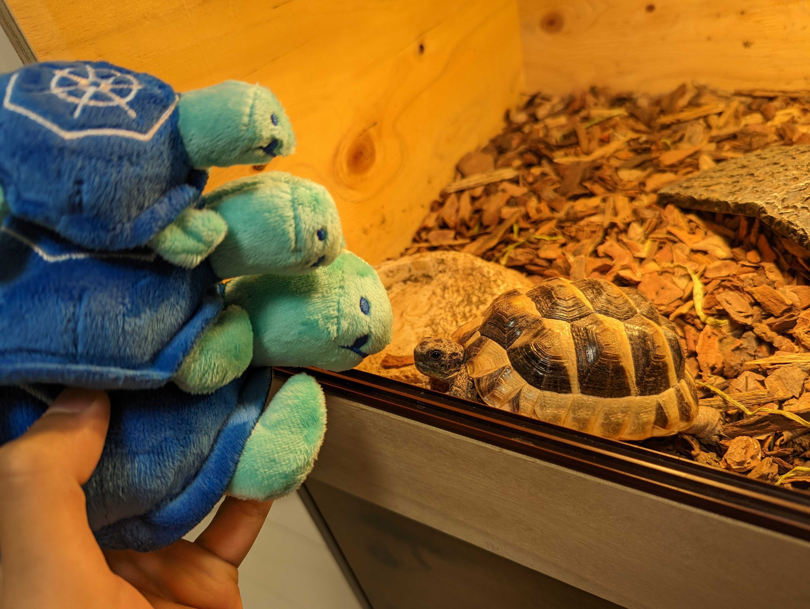

## Concept

The resource management in Kubernetes world is difficult today,
there are many options on your table (HPA, VPA, KEDA, etc) at first, 
there are many parameters on them,
and you want to reduce the wasted resources as long as possible with any of them, 
but at the same time, you need to keep the reliability of workloads.

Tortoise, it aims to solve such complicated situation by system
- give recommended values to Autoscalers from the controller and keep update them.
- use historical resource usage of target workloads to calculate the recommended values on parameters while ensuring the safety.
- expose only few configurations to users.

### General design

We only allow users to configure:
- The way to do autoscaling (vertical or horizontal) for each container.
  - In most cases, it should be OK to leave this configuration empty. Tortoise will use `Horizontal` for CPU and `Vertical` for memory. 
- The minimum amount of resources given to each container. (optional)
  - In most cases, it should be OK to leave this configuration empty as well. Tortoise will ensure safety of the resource reduction based on the values suggested by VPA.
  - But, the application developers may want to increase the resource request before they bring something big to workloads which will affect the resource usage very much.

But, for the cluster admin, we allow some global configurations 
so that the cluster admin can make Tortoises fit their general workloads characteristic.

### How do workloads exactly get scaled?

See each document:
- [Horizontal scaling](./horizontal.md) 
- [Vertical scaling](./vertical.md)

### Emergency mode

We also have the concept "emergency mode" in Tortoise, 
which can be used when the workloads need to get scaled up in an unusual case.

See the document for more detail: [The emergency mode](./emergency.md)

## Side Notes

It's implemented based on our experience in mercari.com

- Our workloads are mostly Golang HTTP/GRPC server.
- Our workloads mostly get traffic from people in the same timezone, and the demand of resources is usually very similar to the same time one week ago.

Depending on how your workloads look like, tortoise may or may not fit your workloads.
