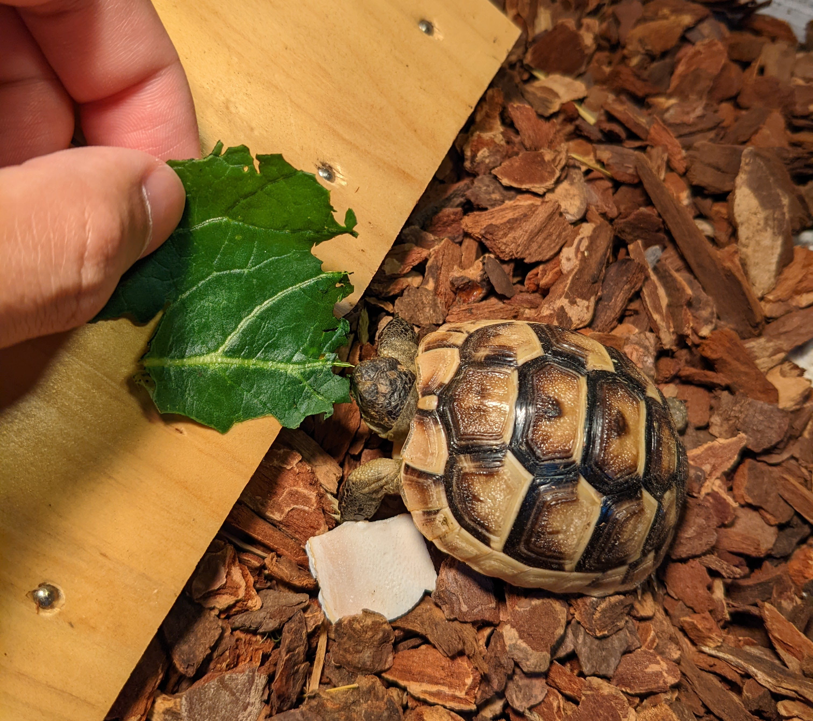

## Tutorial



This document describes how you can live with your tortoises.

I'll show you some usecases.

### Tutorial1: create the default tortoise 

#### 1. install the tortoise controller

```shell
make install
make deploy
```

#### 2. preparation

You need to prepare the deployment which will be managed by tortoise.

```shell
kubectl create ns tortoise-poc
kubectl apply -f ./docs/tutorial-manifests/
```

#### 4. cleanup

```shell
kubectl delete ns tortoise-poc
```
