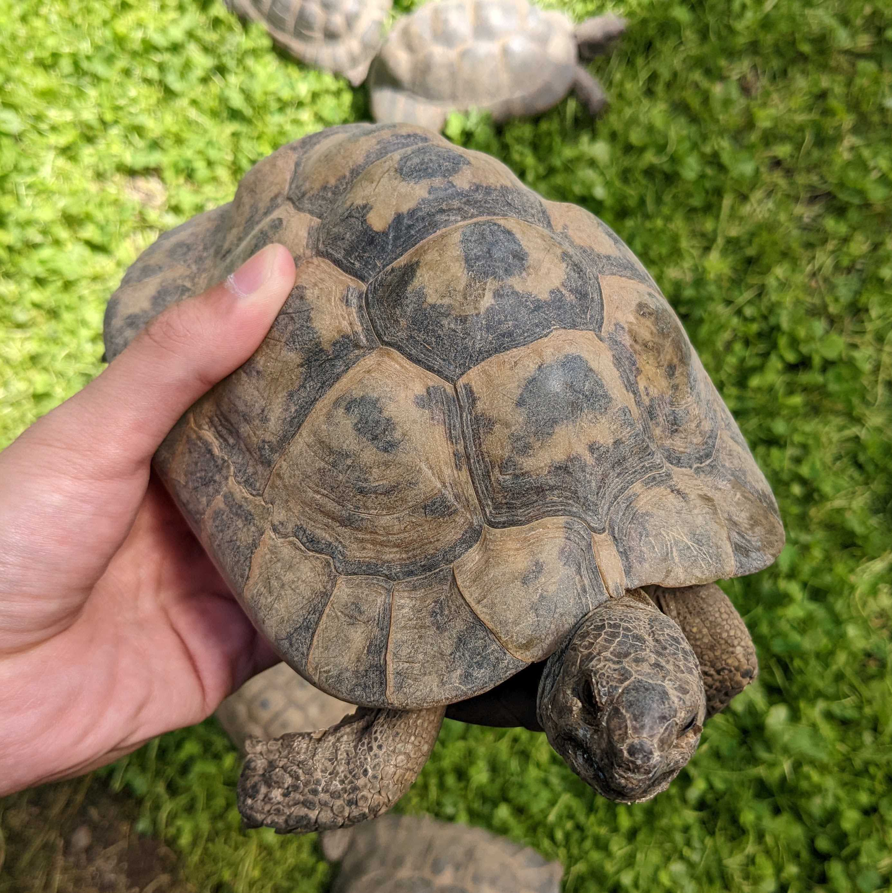

## Vertical scaling

 

You can configure resource(s) to be scaled by vertical scaling
by setting `Vertical` in `Spec.ResourcePolicy[*].AutoscalingPolicy`

Tortoise basically utilizes [Vertical Pod Autoscaler (VPA)](https://github.com/kubernetes/autoscaler/tree/master/vertical-pod-autoscaler) under the hood.

And, VPA basically generates the recommendation of the resource request by checking p90~max of historical resource usage 
during a certain period of time (around 1 week).

Specifically, they are calculated using a decaying histogram of weighted samples from the metrics server, 
_where the newer samples are assigned higher weights_.

### How it's different from VPA?

The vertical scaling in Tortoise is actually similar to VPA, but more conservative/safer.

#### Rolling upgrade instead of the eviction

Until [in-place pod resizing feature](https://github.com/kubernetes/enhancements/issues/1287) arrives, 
we have to replace Pods when you want to change the resource size of Pods.

For the replacement, VPA evicts Pods, following PodDisruptionBudget (PDB).

This replacement works well in deployments with a large scale
because Pods can work fine if, for example, 1 Pod out of 30 Pods is killed for the replacement.

But, if the deployment has only 3 Pods and VPA deletes 1-2 Pods (depending on PDB) for the replacement,
it'd be dangerous since remaining alive Pod(s) have to deal with 1.5~3 times larger traffic during the replacement.

Because of this reason, Tortoise uses the rolling upgrade that is controlled by Deployment for the replacement.

As long as you define the safer [.spec.strategy](https://kubernetes.io/docs/concepts/workloads/controllers/deployment/#strategy),
Pods are replaced without lacking the number of Pods. 

But, it also made a downside in Tortoise which it cannot support resources other than Deployment.

#### Conservative scaling down

Even though Tortoise is using a rolling upgrade to minimize the bad impact on service,
we don't want to do such replacements very frequently.

Thus, Tortoise is allowed to scale down only once an hour, even if the resource request recommendation keeps decreasing in an hour.

Also, to prevent a big scaling down, Tortoise has [`MaxAllowedScalingDownRatio`](./admin-guide.md#maxallowedscalingdownratio) to specify how much Tortoise can scales down at one scaling down. 

On the other hand, Tortoise always scales **up** the resource request as soon as possible
regardless of whether Tortoise recently has scaled the resources or not.

#### Golang environment variables support

In Golang, there are some environment variables to tune how your service consumes resources, such as `GoMAXPROCS`, `GOMEMLIMIT`, and `GOGC`.
Tortoise keeps `GOMAXPROCS` and `GOMEMLIMIT` proportional to request, that is, if CPU is doubled and Memory is tripled,
`GOMAXPROCS` is also doubled, and `GOMEMLIMIT` is also tripled.

Note that, this modification only happens when if you set those environment variables through `pod.Spec.Containers[x].Env.Value`.
If you manage your environment variables through configmap or something else, Tortoise cannot modify the values.

### Known Limitation

- It doesn't care [Limit Ranges](https://kubernetes.io/docs/concepts/policy/limit-range/) at all.
