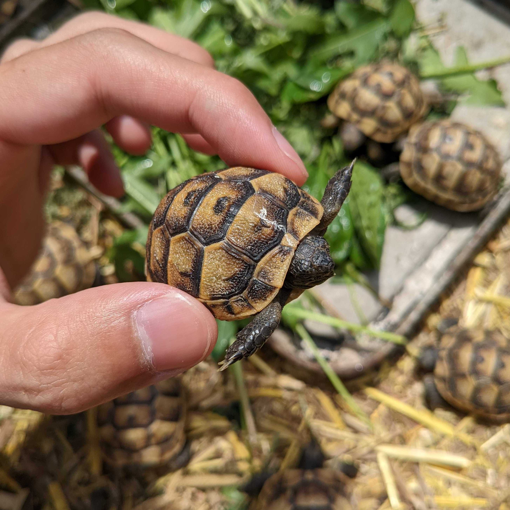

## Vertical scaling

 

You can configure resource(s) to be scaled by horizontal scaling
by setting `Vertical` in `Spec.ResourcePolicy[*].AutoscalingPolicy`

When `Vertical` is specified on the resource,
that resource is basically updated based on the recommendation value from the VPA.

### How it's different from ordinary VPA?

Tortoise's Vertical scaling is similar but more conservative/safer than how VPA does.

#### Rolling upgrade instead of the eviction

Until [in-place pod resizing feature](https://github.com/kubernetes/enhancements/issues/1287) arrives, 
we have to replace Pods when you want to change the resource size of Pods.

For the replacement, VPA evicts Pods, following PodDisruptionBudget (PDB).

This replacement works well in deployments with a large scale
because Pods can work fine if, for example, 1 Pod out of 30 Pods is killed for the replacement.

But, if the deployment has only 3 Pods and VPA deletes 1-2 Pods (depending on PDB) for the replacement,
it'd be dangerous since remaining alive Pod(s) have to deal with 1.5~3 times larger traffic during the replacement.

Because of this reason, Tortoise uses the rolling upgrade that is controlled by Deployment for the replacement.

As long as you define the safer [.spec.strategy](https://kubernetes.io/docs/concepts/workloads/controllers/deployment/#strategy),
Pods are replaced without lacking the number of Pods. 

But, it also made a downside in Tortoise which it cannot support resources other than Deployment.

#### Conservative scaling down

Even though Tortoise is using a rolling upgrade to minimize the bad impact to service,
we don't want to do such replacement very frequently.

Thus, Tortoise is allowed to scale down only once an hour, even if the resource request recommendation keeps decreasing in an hour.

On the other hand, Tortoise always scales **up** the resource request as soon as possible
regardless of whether Tortoise recently has scaled the resources or not.
